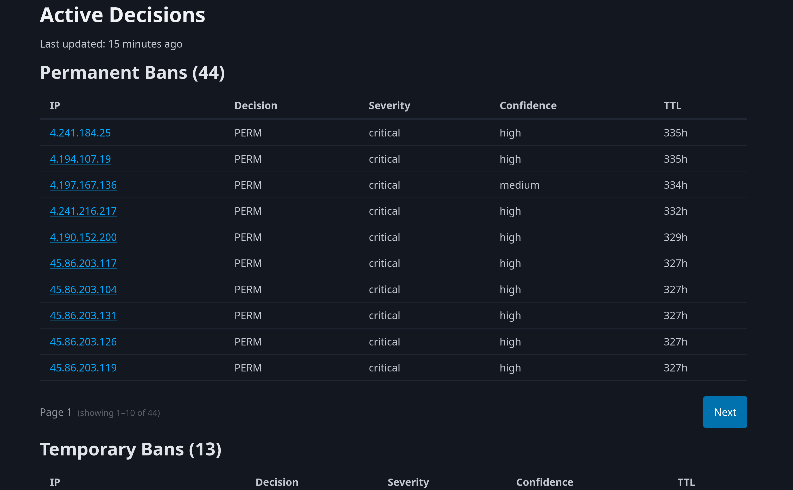

# Threat Decision Engine & Observability Dashboard  
*A lightweight, real-time threat-decision pipeline with a clean operator dashboard.*

## Overview  
This project powers a distributed **threat-decision engine** with decisions from a fleet of nodes feeding in. It ingests signals, correlates activity, and produces **high-confidence enforcement decisions** (e.g., `PERM_BAN`) backed by evidence, severity, and confidence scoring.

A lightweight **Flask + PicoCSS dashboard** provides real-time visibility into active decisions, TTLs, severity levels, and supporting evidence. Everything runs on a tiny VPS with **Caddy reverse proxy**, **Gunicorn**, and **SQLite**, demonstrating how far you can push efficient, production-grade design.

## Features  
- **Real-time decision engine**: correlates signals across nodes and produces structured enforcement decisions - pulled directly from a public-facing API (threats.beane.me/api). 
- **Confidence & severity scoring**: each decision includes a score, label, and severity classification.
- **SQLite-backed persistence**: decisions are cached with TTLs, timestamps, and evidence for fast retrieval.
- **Operator dashboard**: clean, responsive UI built with Flask + PicoCSS.
- **Explain mode**: click an IP to view reason codes, scenarios, evidence, and TTL.
- **Caddy reverse proxy**: TLS, compression, logging, and API protection. 
- **Gunicorn systemd service**: production-grade deployment with automatic restarts.
- **Runs on a $6.75/year node**: efficient by design, minimal resource footprint.

## Architecture  
- **Frontend**: Flask app served by Gunicorn, reverse-proxied by Caddy.
- **Backend engine**: Python decision engine with structured evidence and TTL logic.
- **Persistence layer**: SQLite with upsert logic and ISO-8601 timestamps. 
- **Nodes**: distributed agents feeding signals into the engine.
- **Dashboard**: operator-focused view of active decisions.

## Tech Stack
- **Python** (decision engine, backend)
- **Flask** (dashboard)
- **SQLite** (persistence)
- **Caddy** (TLS + reverse proxy)
- **Gunicorn** (production WSGI)
- **PicoCSS** (lightweight UI)

## Project Layout

```threat-decision-engine/
├── frontend/          # Flask dashboard
├── threat_engine/     # Decision engine + persistence
├── cli/               # Command-line interface
├── logs/              # Operational logs
└── tests/             # Unit tests
```

## Dashboard Preview  
A clean table of active decisions with IP, decision type, severity, confidence, and TTL.
Clicking an IP opens a full explanation including reason codes, scenarios, and evidence.

<p align="center">
  
</p>

Viewable at [observe.beane.me](https://observe.beane.me)

## Installation  
```bash
git clone https://github.com/patrickbeane/threat-decision-engine.git
cd threat-decision-engine
python3 -m venv venv
source venv/bin/activate
pip install -r requirements.txt
```

## Running with Gunicorn
A minimal systemd service:
```[Unit]
Description=Observability Dashboard (Gunicorn)
After=network.target

[Service]
User=youruser
Group=yourgroup
WorkingDirectory=/path/to/threat-decision-engine
Environment="PATH=/path/to/threat-decision-engine/venv/bin"
ExecStart=/path/to/threat-decision-engine/venv/bin/gunicorn -w 2 -b 127.0.0.1:5000 frontend.app:app
Restart=always

[Install]
WantedBy=multi-user.target
```

Enable and start:
```sudo systemctl daemon-reload
sudo systemctl enable observability.service
sudo systemctl start observability.service
```

## Usage
- Example cron-based enforcement loop (idemponent, locked and logged): `cd /path/to/threat-decision-engine && flock -n ~/.local/state/threat-decision-engine.lock bash -c 'echo "=== $(date) ===" >> logs/threat-decision.log && ./venv/bin/threat-engine --input https://threats.beane.me/api --mode enforce --limit 10 --yes >> logs/threat-decision.log 2>&1'`
- Visit `/` for the dashboard
- Visit `/explain/<ip>/` for detailed reasoning
- Visit `/api/decisions` (ideally password-protected) for JSON output
- Also usable from the command line, ex: `threat-engine --mode explain --ip 1.2.3.4` or `threat-engine --help` for parameters

## Example Output

```threat-engine --mode explain --ip 1.2.3.4
[PERM_BAN] 1.2.3.4 (confidence: high)
  - Threat activity was observed independently on multiple nodes.
  - Multiple stages of an attack chain were observed within a short time window.
  - Observed behavior consistent with post-compromise activity, such as backdoors, webshells, or lateral movement.
  - High-confidence indicators of post-exploitation activity were detected.

Evidence (cached decision):
  - Nodes observed: 2
  - Severity: critical
  - TTL remaining: 14d
```

## Why This Project Exists
This platform started as a simple ban-cache and evolved into a real, distributed threat-decision engine with explainability, persistence, and operator visibility. It’s intentionally small, intentionally efficient, and intentionally transparent, a practical demonstration of building reliable security automation without heavyweight tooling.

## License
MIT License
